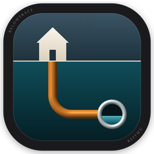
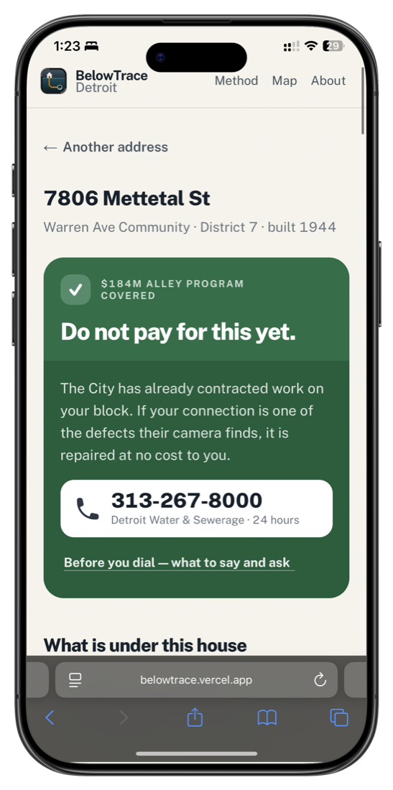
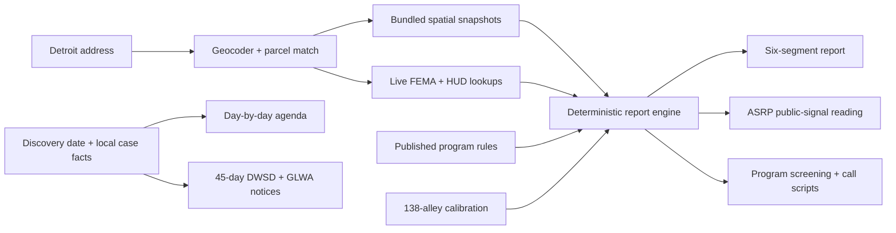

<div align="center">
  

# BelowTrace Detroit

### Will the City fix your sewer line, or will you pay for it?

[**Open the live app**](https://belowtrace.vercel.app) · [Method](https://belowtrace.vercel.app/method) · [Citywide map](https://belowtrace.vercel.app/map) · [Sources](https://belowtrace.vercel.app/sources) · [Pitch deck](deliverables/BelowTrace-Venture313-Deck.pdf)

Free · No sign-up · City of Detroit only · No AI at runtime
</div>



## The decision BelowTrace helps make

Detroit is spending **$184,421,000** to repair about **9,000 residential sewer connections** over four years. If a City contract reaches an alley, an eligible connection is repaired at no cost to the homeowner. If it does not, the same household may face a **$5,000–$25,000** private repair.

Residents cannot apply to the Alley Sewer Repair Program. DWSD publishes the selection criteria, but not the selected-address list, the rollout schedule, or the 30,000+ camera-confirmed defect records behind its decisions. A homeowner holding a five-figure quote is therefore left with a very practical question and no public lookup:

> **Should I wait for the City, call another program, or pay now?**

BelowTrace turns one Detroit address into an evidence-backed action plan. It combines the public signals behind the alley program with parcel, sewer, permit, floodplain, income, 311, capital-project, and program-rule data; explains what is known and what is not; and ends with the exact calls and deadlines that still require human confirmation.

## What the product does now

### 1. Reads one address against the City's public evidence

The address report shows:

- where the address sits relative to the **138 alleys already under contract**;
- nearby sewer cave-ins and basement-flooding reports within the same 500 m radius used by the calibration;
- HUD low/moderate-income share, 2026 council district, and distance to contracted alley work;
- the nearest recorded DWSD main, nearby capital projects, plumbing permits, parcel facts, FEMA floodplain status, and PSRP neighborhood coverage;
- every failed or unavailable lookup as **unknown**, never silently converted to “no.”

The result is an explainable action reading, not a hidden score: work already contracted nearby, a public-signal match worth calling about, a weak match, or no first-round work in that district.

### 2. Explains the sewer as six different responsibilities

Detroit assistance is organized around *which part of the system failed*, not around the resident's symptom. BelowTrace puts all six segments side by side:

| # | Segment | Legal/operational owner | Possible payer or response |
|---|---|---|---|
| 1 | Pipes inside the house | Homeowner | Homeowner · MDHHS emergency relief |
| 2 | Building drain under the basement | Homeowner | Basement Backup Protection Program · homeowner |
| 3 | Private lateral to the property line | Homeowner | Private Sewer Repair Program, up to $30,000 · homeowner |
| **4** | **Connection beneath the public alley** | **Homeowner, under public ground** | **$184M Alley Sewer Repair Program · homeowner** |
| 5 | Public sewer main | City of Detroit | DWSD |
| 6 | Regional system capacity | Regional system | Damage claim for losses, not pipe repair |

For each segment, the report explains the typical symptom, the responsible owner, which programs might pay, why an address does or does not match a visible rule, and what to ask next.

### 3. Turns the answer into a phone call

Because DWSD's decisive CCTV evidence is not public, every alley-program reading ends in a call. The app provides:

- the correct department and phone number;
- a short call script based on the address;
- the three questions that change the decision;
- the facts and reference numbers to record before hanging up.

The product does not pretend an open-data model can replace the agency record that residents actually need.

### 4. Handles an active basement backup

`/now` starts a local case file from the day the water was discovered and produces a day-by-day agenda. It tracks the urgent safety and evidence work, neighbor signals, the DWSD service-request number, the insurance claim, photos, water depth, program calls, and the legal notice clock.

Case data stays in the browser. The urgent workflow still renders without the optional network lookup, which matters in basements with poor signal.

### 5. Produces the 45-day written notice

Michigan law gives a resident **45 days from discovery** to put a sewage-disposal-system claim in writing. `/notice` collects the six required facts already stored in the case and generates two ready-to-print letters:

- one for the City of Detroit/DWSD;
- one for the Great Lakes Water Authority.

The page tracks whether each letter was mailed, explains why both agencies receive one, and keeps missing information visible without inventing a cause or dollar amount.

## The current finding

DWSD says it chooses alley work using camera-confirmed connection failures, recorded alley cave-ins or sinkholes, federal low/moderate-income rules, and phased geography. The decisive camera records and the complete selected-alley list are not public.

BelowTrace queried all **782 feature services** in the City of Detroit's ArcGIS organization. For sewers, only catch basins and a partial gravity-main layer were public; none of the 30,000+ failed-connection observations appeared in an open layer. The calibration therefore tests only the criteria that can be reproduced from public data.

I compared:

- **138 current-program alleys**: 65 in construction and 73 in procurement;
- **47 earlier completed alley projects**;
- Improve Detroit water-in-basement and cave-in reports within 500 m of each project midpoint.

| Median reports within 500 m | Current program, n=138 | Earlier alley projects, n=47 |
|---|---:|---:|
| Water in basement | **18** | **45** |
| Cave-ins | **26** | **19** |

The difference in medians is significant for basement flooding (**permutation p < 0.0001**) and cave-ins (**p = 0.0115**). Of all **14,115** basement-flooding reports recorded since January 2023, only **1.0%** fall within 200 m of a currently contracted alley.

First-round distribution is also highly concentrated:

| Council district | 1 | 2 | 3 | 4 | 5 | 6 | 7 |
|---|---:|---:|---:|---:|---:|---:|---:|
| Contracted alleys | 55 | **0** | **0** | **0** | **0** | 80 | 3 |

The evidence supports a narrower claim than “the City chose the wrong places”: **the first round follows recorded cave-ins more closely than resident-reported basement flooding, and four districts have no contracted alleys yet.** The program has three more years to change. The full test, third comparison, thresholds, and caveats are documented on [`/method`](src/app/method/page.tsx) and can be regenerated from the bundled snapshots.

## How an address becomes an answer



There is no generative model in this path. Rules and phone numbers live in source-controlled data, spatial calculations are deterministic, and evidence travels with the result.

## Routes

| Route | Purpose |
|---|---|
| `/` | Core claim, address search, citywide evidence, and entry points |
| `/report?address=…` | Address-level six-segment report and alley-program reading |
| `/now` | Local, day-by-day response plan for an active backup |
| `/notice` | 45-day notice builder for DWSD and GLWA |
| `/method` | Reproducible calibration, thresholds, findings, and caveats |
| `/map` | Full-screen citywide flooding and contracted-alley layers |
| `/sources` | Source register with check dates and known coverage limits |
| `/about` | The resident, policy, impact, sustainability, and proof story |
| `/deck` | Seven-slide Venture 313 presentation view |
| `/api/report?address=…` | Full address report as JSON |
| `/api/suggest?q=…` | Detroit address suggestions |
| `/api/locate?lat=…&lng=…` | Coordinate-to-address lookup with Detroit parcel fallback |

Example:

```bash
curl 'https://belowtrace.vercel.app/api/report?address=16776%20Prevost%20St'
```

## Data and evidence model

| Layer | Use | Behavior |
|---|---|---|
| City parcels | Exact property match and lot geometry | Live lookup; warning on nearest-parcel fallback |
| Improve Detroit 311 | Water-in-basement, sewer cave-in, and other cave-in density | Bundled snapshot dated **2026-09-18** |
| DWSD gravity mains | Nearest recorded public main and map context | Bundled, explicitly marked as partial coverage |
| DWSD capital projects | Contracted and earlier alley projects | Bundled snapshot and calibration input |
| BSEED plumbing permits | Evidence that a line or valve was worked on | Bundled by parcel and proximity |
| Detroit 2026 council districts | First-round distribution and address context | Bundled geometry |
| PSRP neighborhoods | Whether the address is in one of the 97 program neighborhoods | Bundled geometry; not a final eligibility decision |
| HUD low/mod income | Public federal-funding signal | Live lookup; unavailable remains unknown |
| FEMA flood hazard layer | PSRP floodplain exclusion signal | Live lookup; unavailable remains unknown |
| Published City, DWSD, GLWA, HUD, FEMA, MSHDA, and Michigan-law documents | Program rules, dates, contacts, costs, and notice requirements | Rule/contact register rechecked **2026-09-21** |

Run `node scripts/calibrate-asrp.mjs` to regenerate the current 138-vs-47 comparison from the checked-in spatial snapshots. The raw-data build path is in `scripts/fetch_data.py` and `scripts/build-data.mjs`.

## Trust boundaries

BelowTrace is deliberately opinionated about uncertainty:

- **It does not know whether DWSD's camera found a defect at a specific connection.** That record is not public.
- **It does not draw a guessed private sewer line.** The property illustration is a labeled schematic; mapped lines are recorded public assets only.
- **It does not treat missing data as a negative result.** An unavailable parcel, FEMA, HUD, or main lookup stays unknown and produces a visible warning.
- **It does not decide program eligibility.** It screens the published rules and exposes contradictions, including the PSRP guide's different income thresholds.
- **It does not write an unproven cause into a legal notice.** The notice records required facts and leaves causation to the investigation.
- **It does not claim outcome validation.** No resident outcome study or agency adoption has been completed yet.

This is not a utility locate, a camera inspection, or legal advice. Program rules can change; confirm a decision with the agency that owns it.

## Privacy and runtime behavior

- No account or sign-up.
- No AI at runtime.
- Active-case facts are stored in the resident's browser, not a project database.
- The address report uses a 24-hour in-memory server cache for successful parcel-backed lookups.
- Golden reports provide a transparent fallback for known demo addresses when an upstream service is temporarily unavailable.
- No private-lateral geometry is fabricated or inferred from the public main.

## Local development

Requirements: Node.js 20+ and npm.

```bash
git clone https://github.com/ReffWu/belowtrace.git
cd belowtrace
npm ci
npm run dev
```

Open [http://localhost:3000](http://localhost:3000).

### Checks and data tasks

```bash
npm test                         # 11 files, 112 tests
npm run lint
npm run build
npm run data                     # refresh raw sources and rebuild snapshots
node scripts/calibrate-asrp.mjs  # regenerate the alley-program calibration
```

## Code map

| Path | Responsibility |
|---|---|
| [`src/lib/report.ts`](src/lib/report.ts) | Address normalization, source orchestration, spatial context, caching, warnings, and report assembly |
| [`src/lib/asrp.ts`](src/lib/asrp.ts) | Public-signal assessment calibrated against the 138 contracted alleys |
| [`src/lib/anatomy.ts`](src/lib/anatomy.ts) | Six sewer segments, ownership, symptoms, payers, and top-line decision |
| [`src/lib/geo.ts`](src/lib/geo.ts) | Indexed lookups against bundled Detroit spatial snapshots |
| [`src/lib/programs.ts`](src/lib/programs.ts) | Address-aware repair and relief-program cards |
| [`src/lib/agenda.ts`](src/lib/agenda.ts) | Deadline-aware response schedule for an active backup |
| [`src/lib/law.ts`](src/lib/law.ts) | Michigan's 45-day statutory clock and required notice facts |
| [`src/lib/notice.ts`](src/lib/notice.ts) | DWSD and GLWA notice generation |
| [`src/lib/store.ts`](src/lib/store.ts) | Browser-local case persistence and recovery |
| [`src/lib/facts.ts`](src/lib/facts.ts) | Source-controlled contacts, costs, deadlines, and verification date |
| [`scripts/calibrate-asrp.mjs`](scripts/calibrate-asrp.mjs) | Reproducible statistical calibration |
| [`src/app/deck`](src/app/deck) | Seven-slide presentation rendered from the same product evidence |

## Tech stack

- Next.js 16.3 and React 19
- TypeScript 5
- Tailwind CSS 4
- MapLibre GL 6
- Turf and Flatbush for spatial work
- Three.js for the property-system illustration
- Vitest for deterministic rule, geometry, API, persistence, and notice tests
- Vercel for the public deployment

## Project materials

- [Venture 313 seven-slide deck (PDF)](deliverables/BelowTrace-Venture313-Deck.pdf)
- [Citywide method](https://belowtrace.vercel.app/method)
- [Every public source](https://belowtrace.vercel.app/sources)

Built for the **Venture 313 Buildathon 2026**, Challenge 03: Reliable Transportation, Infrastructure & Sustainability.

Built with AI coding assistance. The shipped application itself is deterministic and uses no AI at runtime.

## License

[MIT](LICENSE)
